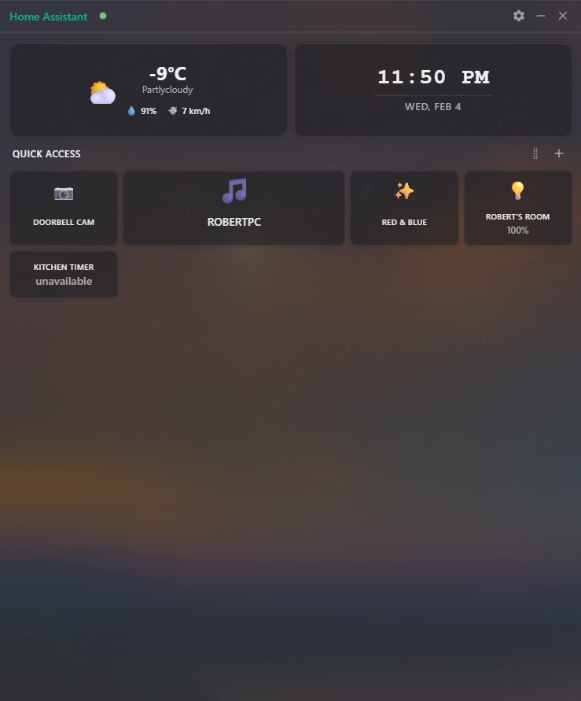
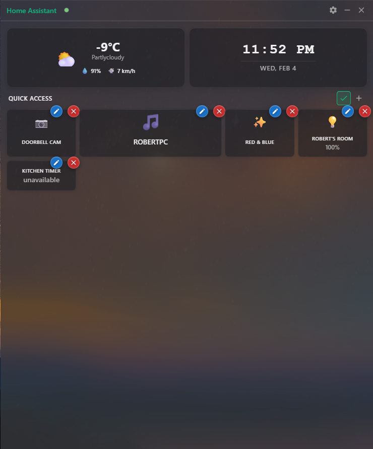
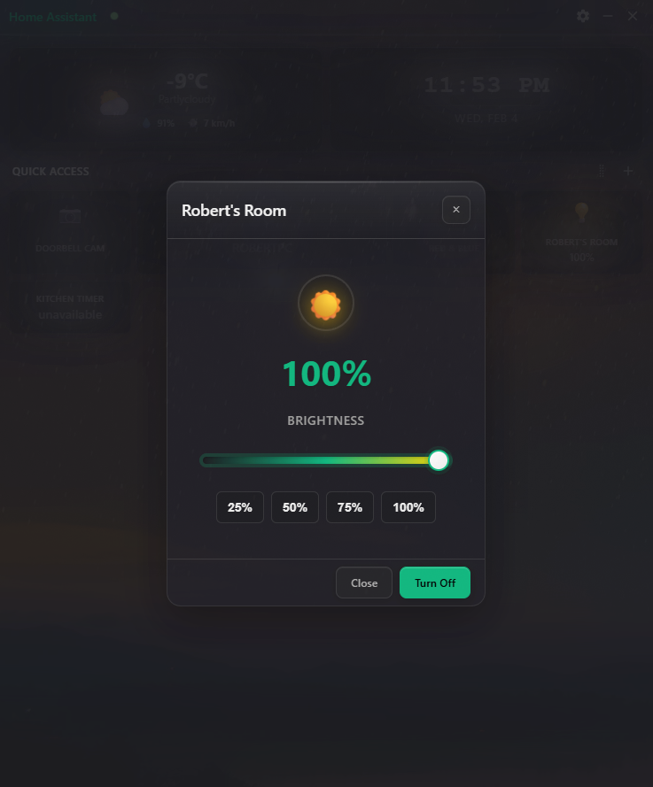

# HA Desktop Widget

A semi-transparent desktop widget for Home Assistant that provides quick access to your smart home devices from your desktop.

[](https://github.com/Robertg761/HA-Desktop-Widget/actions/workflows/ci.yml)
[](https://github.com/Robertg761/HA-Desktop-Widget/actions/workflows/release.yml)
[](LICENSE)

- Download: https://github.com/Robertg761/HA-Desktop-Widget/releases

- [](https://github.com/sponsors/robertg761)

  

## Settings: Personalization


The Personalization tab covers themes, window effects, primary cards, and media tile selection. Other Settings tabs include hotkeys, alerts, updates, and log access.

## Features

### Smart Home Control
- **Real-time Updates**: WebSocket connection for instant entity state changes
- **Quick Access Dashboard**: Customizable grid of your most-used entities
- **Entity Management**: Add, remove, and reorder entities with drag-and-drop
- **Custom Names**: Rename entities with custom display names that persist
- **Interactive Controls**: Toggle lights, switches, scenes, and more with a single click

### Modern Interface
- **Rainmeter-style Design**: Clean, transparent desktop widget aesthetic
- **Responsive Layout**: Auto-sizing tiles that adapt to content
- **Dark/Light Themes**: Automatic theme switching based on system preferences
- **Smooth Animations**: Fluid drag-and-drop and hover effects
- **Toast Notifications**: Real-time feedback for all actions

### Entity Support
- **Lights**: Toggle on/off, brightness control with vertical slider
- **Switches & Fans**: Simple on/off controls
- **Sensors**: Real-time value display with units
- **Timers**: Live countdown displays for active timers
- **Cameras**: Live feed viewing with snapshot fallback
- **Climate**: Temperature display and control
- **Media Players**: Play/pause, previous/next, artwork, and seek bar
- **Scenes**: One-click scene activation

### Advanced Features
- **Auto-Updates**: Seamless background updates from GitHub
- **System Tray**: Minimize to tray with quick access menu
- **Configuration**: Easy setup with Home Assistant URL and token
- **Performance**: Optimized rendering and memory management
- **Cross-Platform**: Windows and macOS support with transparency effects
- **Personalization**: Accent/background themes, window opacity, and frosted glass
- **Hotkeys**: Global entity hotkeys and popup hotkey to bring the window to front
- **Alerts**: Desktop notifications for entity state changes
- **Primary Cards**: Configure the top two cards (weather/time or any entity)
- **Media Tile**: Choose a primary media player or hide the tile

## Quick Start

### Download & Install
1. Go to the [Releases](https://github.com/Robertg761/HA-Desktop-Widget/releases) page and download the latest available installer or portable build.
2. If using the Installer: run the .exe and follow the prompts. If using the Portable build: unzip and run the executable (no installation required).
3. Run the app and click the Settings button to configure your Home Assistant connection.

### First-Time Setup
1. **Get your Home Assistant URL**: Usually `http://your-ha-ip:8123` or `https://your-ha-domain.com`
2. **Create a Long-Lived Access Token**:
   - Go to your Home Assistant profile (click your avatar)
   - Scroll down to "Long-lived access tokens"
   - Click "Create token" and give it a name like "Desktop Widget"
   - Copy the generated token
3. **Configure the widget**:
   - Paste your HA URL and token in Settings
   - Click "Save" - the widget will connect automatically
4. **Add entities**: Click the "+" button to add your favorite entities to Quick Access

## How to Use

### Quick Access Management
- **Add Entities**: Click the "+" button to search and add entities to your dashboard
- **Reorder**: Click the Reorganize button to enter reorganize mode, then drag and drop to reorder
- **Rename**: In reorganize mode, click the edit icon to set custom display names
- **Remove**: In reorganize mode, click the remove button to remove entities

### Entity Interactions
- **Lights**: Click to toggle, long-press for brightness slider
- **Cameras**: Click to view live feed in popup window
- **Sensors**: Display real-time values with automatic unit formatting
- **Timers**: Show live countdown when active
- **Scenes**: Click to activate instantly

### System Integration
- **Minimize to Tray**: Click the minimize button to hide to system tray
- **Auto-Updates**: The app automatically checks for and installs updates
- **Settings**: Access via the Settings button or right-click the tray icon

### Settings Highlights
- **Themes**: Choose accent and background color themes
- **Window Effects**: Adjust opacity and toggle frosted glass
- **Primary Cards**: Pin weather/time or any entity to the top two cards
- **Media Tile**: Select the primary media player or hide the tile
- **Hotkeys**: Configure global entity hotkeys and a popup hotkey (hold or toggle)
- **Alerts**: Enable desktop notifications for entity state changes

## Advanced Usage

### Build from Source
```bash
git clone https://github.com/Robertg761/HA-Desktop-Widget.git
cd HA-Desktop-Widget
npm install
npm run dev   # Development mode (opens DevTools)
npm start     # Regular run
npm run dist  # Build for distribution
```

### Configuration
- **Config Location**: Stored as `config.json` in Electron's userData directory.
  - **Windows (packaged)**: `%AppData%/Home Assistant Widget/config.json`
  - **macOS (packaged)**: `~/Library/Application Support/HA Desktop Widget/config.json`
  - **Development builds**: typically use `home-assistant-widget` as the folder name
- **Config Contents**: `homeAssistant` (url, token, tokenEncrypted), `favoriteEntities`, `customEntityNames`,
  `selectedWeatherEntity`, `primaryMediaPlayer`, `globalHotkeys`, `entityAlerts`, `popupHotkey`,
  `windowPosition`, `windowSize`, `opacity`, `ui` (theme, highContrast, opaquePanels, density, accent, background),
  and `customTabs`. Other stored values include `primaryCards`, `alwaysOnTop`, `frostedGlass`,
  `popupHotkeyHideOnRelease`, and `popupHotkeyToggleMode`.
- **Security**: Tokens are never committed to version control and are encrypted at rest when supported by the OS

## Troubleshooting

### Connection Issues
- **Verify URL**: Ensure your Home Assistant URL is accessible from your computer
- **Check Token**: Make sure your long-lived access token is valid and not expired
- **Firewall**: Ensure your OS firewall allows the app to connect to your network
- **Network**: Test connectivity by opening your HA URL in a web browser

### Performance Issues
- **Reduce Entities**: Limit the number of entities in Quick Access
- **Visual Effects**: Disable transparency if experiencing performance issues

### Common Solutions
- **Restart**: Close and reopen the app if entities aren't updating
- **Reconnect**: Go to Settings and click "Save" to reconnect to Home Assistant
- **Check Logs**: Use Settings > View Logs to open the log file location

## Contributing

We welcome contributions! Here's how you can help:

### Reporting Issues
- **Bug Reports**: Use the [Issues](https://github.com/Robertg761/HA-Desktop-Widget/issues) page
- **Feature Requests**: Submit enhancement ideas with detailed descriptions
- **Documentation**: Help improve this README or add usage examples

### Development
- **Fork & Clone**: Fork the repository and clone your fork
- **Create Branch**: Make changes in a feature branch
- **Test**: Ensure your changes work and don't break existing functionality
- **Submit PR**: Create a pull request with a clear description of your changes

### Code Style
- **ESLint**: Follow the existing code style (run `npm run lint`)
- **Comments**: Add comments for complex logic
- **Testing**: Add tests for new features when possible

## License

This project is licensed under the MIT License - see the [LICENSE](LICENSE) file for details.

## Acknowledgments

- Built with [Electron](https://electronjs.org/) for cross-platform desktop apps
- Uses [Home Assistant WebSocket API](https://developers.home-assistant.io/docs/api/websocket) for real-time updates
- Inspired by the clean aesthetic of [Rainmeter](https://www.rainmeter.net/) desktop widgets

---

**If you find this project useful, please give it a star on GitHub!**
